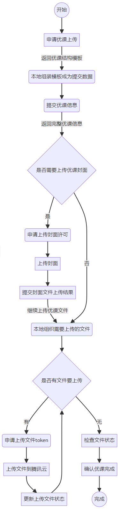

# 演示例子目录结构
- src/main/java/ java代码目录
    - com.qlteacher.demo 演示用例基础包
        - baseinfo 基础信息类查询例子包
        - lesson 课例上传用例子包
        - pojo 实体类包
            - conf 配置类包
            - dto 数据传递类包
            - param 提交参数类包
            - vo 返回对象类包
        - process 流程类包
        - utils 工具类包
    - resource 配置文件和资源目录
        - file 资源文件目录

# 上传课例流程图

## 一师一课演示文档
[document/甲辰一师一课.md](document/甲辰一师一课.md)
